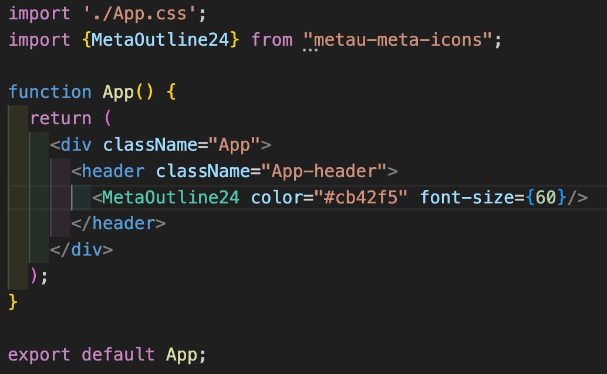

# metau-meta-icons

A set of Meta React SVG icon components.

## Installation

```sh
npm install metau-meta-icons
```

## Usage

```jsx
import { CursorArrowMoveOutline24 } from "metau-meta-icons";

function App() {
  return <CursorArrowMoveOutline24 />;
}
```

A list of all icons can be found in /src/components/icons.
The correct naming conventions can be found in /src/index.js

## Example




## Available Icons

See the `src/components/icons` directory for all available icon names.
